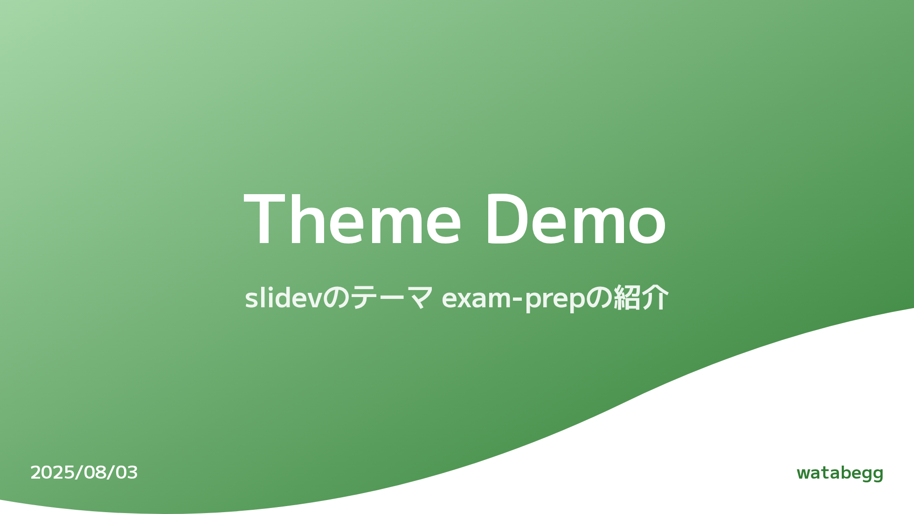
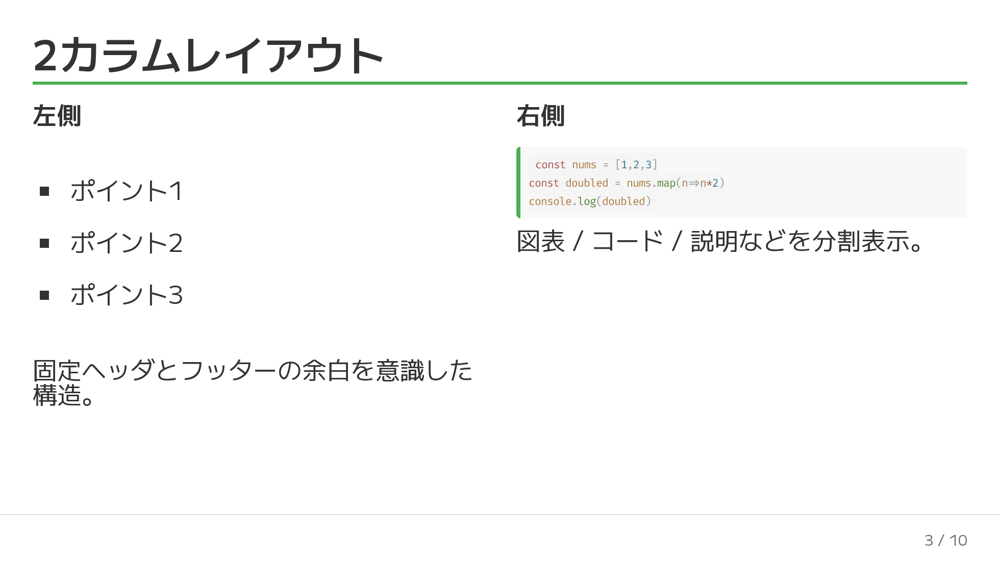
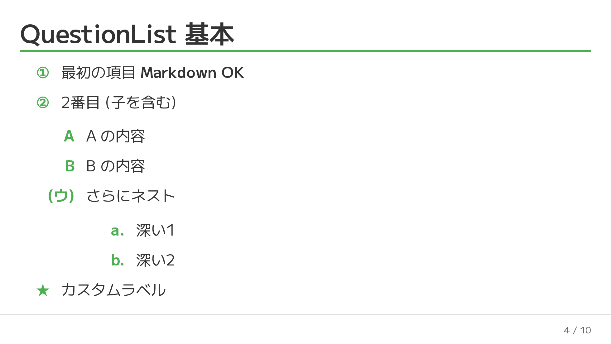

# slidev-theme-exam-prep

[](https://www.npmjs.com/package/slidev-theme-exam-prep)

English README (Japanese version: see `README.ja.md`).

## Overview
An education-focused Slidev theme for exam preparation & classroom lessons, optimized for Japanese typography, high readability, structured question hierarchies, and keyboard-centric navigation. Originally built for personal teaching use.

## Features
- Minimal classroom-oriented design
- Japanese font (M PLUS 2) + monospace Fira Code
- Automatic footer (date + current/total page) except on `cover` / `image`
- Shortcuts: Enter (next) / Backspace (previous)
- Layouts: `cover`, `two-cols`, `image`
- Components: `QuestionList`, `TextBox`
- Multi-level labels: circled numbers / Katakana / Hiragana / kanji numerals (1–19) / alphabet / custom
- Utility classes: `.text-highlight`, `.card`
- Shiki code themes: `vitesse-light` / `vitesse-dark`

## Install
Add to your slide frontmatter:
```yaml
---
theme: slidev-theme-exam-prep
---
```
Local development (cloned repository):
```yaml
---
theme: ./
---
```

## Frontmatter Example
```yaml
title: Class Title
subtitle: Subtitle
author: Instructor Name
date: '2025/08/03'
```



## Layouts
| Name | Purpose | Notes |
|------|---------|-------|
| cover | Title slide | Gradient wave + title/subtitle/author |
| two-cols | Two columns | Slots: `::left::` / `::right::` |
| image | Background image | Use `image:` + absolutely placed `TextBox` |

### two-cols Example
```markdown
---
layout: two-cols
---
::left::
Left
::right::
Right
```



### image Example
```markdown
---
layout: image
image: /path/to/bg.jpg
---
<TextBox :x="120" :y="160" :width="360">Note</TextBox>
```

## Components
### QuestionList
Recursive nested lists (questions / answers) with per-level styles and Markdown rendering.
```vue
<QuestionList
  :items="['First **OK**', { text: 'Second', items: ['Child A','Child B'] }]"
  :styles="['decimal-circle','katakana-paren','loweralpha-dot']"
  :start="[1,1,'c']"
/>
```
Counter types: `decimal | hiragana | katakana | kanji | upperalpha | loweralpha | none`  
Decorators: `circle | square | paren | dot | q | big-q | none`  
If an item includes a `label`, it overrides the computed label.



### TextBox
Absolutely positioned overlay (useful on `image` layout or for callouts).
```vue
<TextBox :x="100" :y="220" :width="400" textBg="green" v-click="1">Memo</TextBox>
```
Props: `x`, `y`, `width`, `height`, `textBg`, `color`, `vClick`

## Footer & Shortcuts
- Footer (except on cover / image): displays `date` + current / total pages.
- Enter: next fragment or slide.
- Backspace: previous fragment or slide.

## Utility Classes
- `.text-highlight` inline / line-marker style highlight
- `.card` rounded bordered container with padding


## Development
```bash
pnpm install
pnpm dev
pnpm build
pnpm export
pnpm screenshot
```

## FAQ
**Q. Do I need to configure fonts manually?**  
No. Google Fonts are loaded inside the theme.

**Q. How can I remove the footer?**  
Override `global-bottom.vue` in your own custom theme.

**Q. How do I change the numbering start?**  
Use `:start="[1,'c']"` (array per hierarchy level).

## See Also
Japanese documentation: `README.ja.md`

Happy teaching! 🎓
